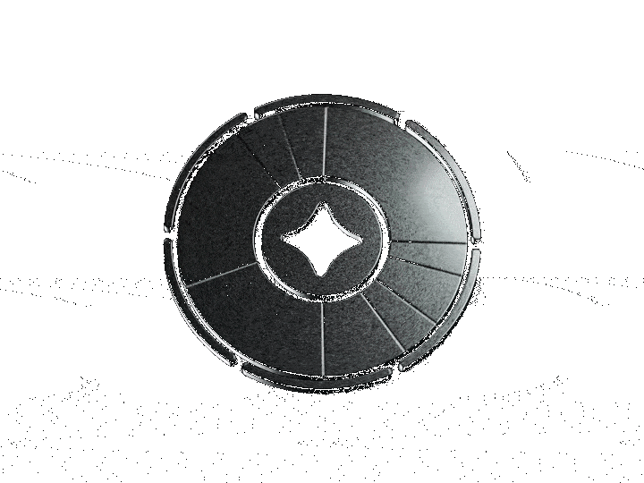
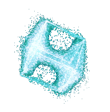
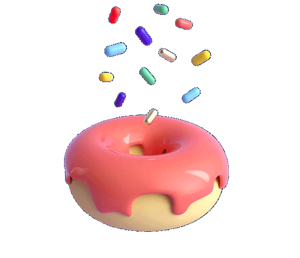

<!-- TOP HOLOGRAM -->
<h2 align="center">Projects</h2>

 

<table width="85%">
  <tr>
    <td align="center" width="50%" height="190" valign="bottom">
      
       
      <strong>Crypto Platform</strong>
       
      Next.js • TypeScript • Tailwind • Authentication • Performance UI
    </td>
    <td align="center" width="50%" height="190" valign="bottom">
      
       
      <strong>Markus Ruhl Personal Page</strong>
       
      Next.js • Three.js • Framer Motion • Personal Website
    </td>
  </tr>
  <tr>
    <td align="center" width="50%" height="170" valign="bottom">
      
       
      <strong>Donut Shop</strong>
       
      Next.js • Stripe • Supabase • PostgreSQL • E-Commerce
    </td>
    <td align="center" width="50%" height="170" valign="bottom">
      
       
      <strong>Mini Auth System</strong>
       
      Next.js • JWT • MongoDB • Secure Authentication
    </td>
  </tr>
</table>

